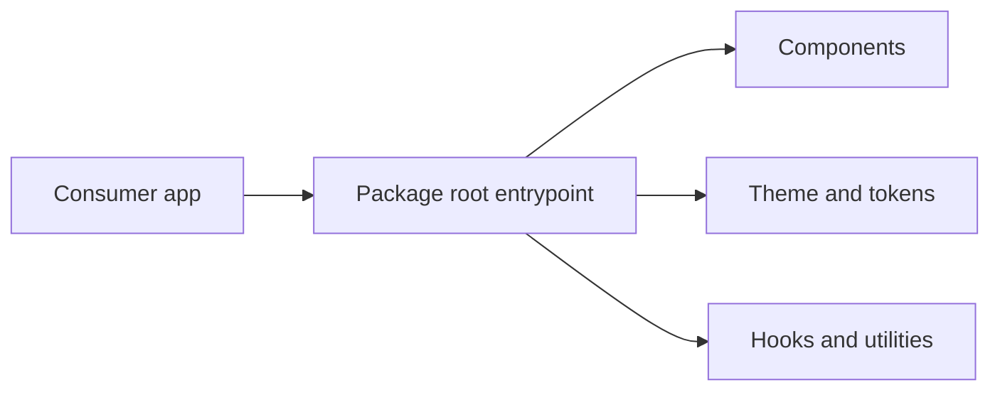

<p align="center">
  
</p>

<h1 align="center">Personal Library React Native Components</h1>

<p align="center">A TypeScript component library for shared React Native and React Native Web interfaces.</p>

<p align="center">
  <a href="https://www.npmjs.com/package/@personal-library/react-native-components"></a>
  <a href="https://github.com/pianic2/personal-library-react-native-components/actions/workflows/ci.yml"></a>
  <a href="LICENSE"></a>
</p>

## Quick Start

Install the current prerelease explicitly:

```sh
npm install @personal-library/react-native-components@0.1.0-rc.2
```

```tsx
import { Button, ThemeProvider } from "@personal-library/react-native-components";

export function App() {
  return (
    <ThemeProvider>
      <Button label="Continue" onPress={() => {}} />
    </ThemeProvider>
  );
}
```

The package requires Node `>=22.13.0`, React `>=19.2.3 <20.0.0` and React Native `>=0.86.0 <0.87.0`. This is a pre-stable release; public APIs may change.

## Package Shape



Import consumer APIs from the package root. Deep imports from `src/` or `dist/` are not supported.

## Development

```sh
npm ci
npm run typecheck
npm test
npm run build
```

| Command | Purpose |
| --- | --- |
| `npm run dev` | Watch TypeScript files without emitting output |
| `npm run package:dry-run` | Inspect the package archive contents |
| `npm run release:check` | Run the full release validation sequence |

## Documentation

- [Getting started](docs/getting-started.md)
- [Components](docs/components.md)
- [Theme](docs/theme.md) · [tokens](docs/tokens/index.md)
- [Platform support](docs/platform-support.md)
- [Expo, React Native and Metro troubleshooting](docs/expo-rn-metro-troubleshooting.md)

## Project Structure

| Path | Contents |
| --- | --- |
| `src/components/` | Exported UI components |
| `src/theme/` · `src/tokens/` | Theme provider and design tokens |
| `src/hooks/` · `src/utils/` | Shared hooks and utilities |
| `tests/` · `examples/` | Tests and consumer examples |
| `docs/` | Component and integration guides |

## Contributing

See [CONTRIBUTING.md](CONTRIBUTING.md) for the repository workflow and validation requirements.

## License

[MIT](LICENSE)
